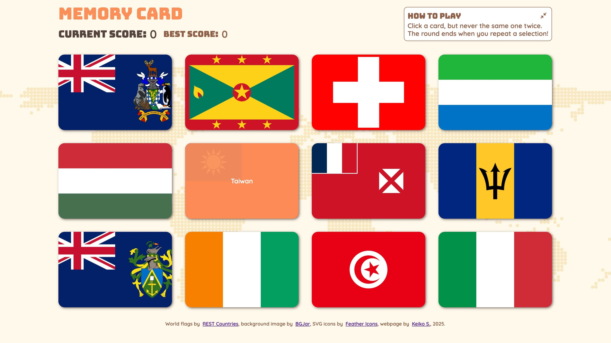

# The Odin Project: Memory Card

 
  

      
  

 

This project is a **Memory Card Game application**, developed to strengthen my understanding of React's fundamental hooks such as **useState**, **useEffect**, while integrating fetched data from a third-party API.

For more details on this project, please visit [The Odin Project - Memory Card](https://www.theodinproject.com/lessons/node-path-react-new-memory-card).

## Key Project Instructions

The application includes the following core components:

### Components

**1. Score Board**

- Current Score:  Tracks the player’s score for the current round.
- Best Score:  Stores the highest score among all rounds.

**2. Cards**

- Assorted Card Set:   Ensures enough cards for gameplay.
- Images and Texts:   Retrieves card data from a third-party API, preferably both images and text.
- Shuffling:   Randomizes the order of cards each time a player clicks one.

## Built With

- HTML
- CSS
- JavaScript
- React
- Vite
- ESLint
- Prettier

---

### Referenced Tutorials

- [Fetch Data from an API by Design+Code](https://designcode.io/react-hooks-handbook-fetch-data-from-an-api)

- [How to Shuffle the Elements of an Array in JavaScript? by GeeksforGeeks](https://www.geeksforgeeks.org/how-to-shuffle-the-elements-of-an-array-in-javascript/)

- [How to Refresh a Page or Component in React by Upmostly](https://upmostly.com/tutorials/how-to-refresh-a-page-or-component-in-react)

- [Solving Sticky Hover States with @media (hover: hover) by CSS-Tricks](https://css-tricks.com/solving-sticky-hover-states-with-media-hover-hover/)

- [Finally, a CSS Only Solution to :hover on Touchscreens by Mezo Istvan](https://itnext.io/finally-a-css-only-solution-to-hover-on-touchscreens-c498af39c31c)
